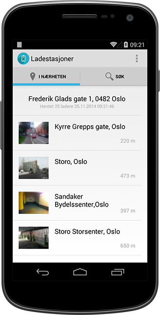

# Charging Stations

___

Android app which finds charging stations nearby for your electric car, originally created in App Development (DAVE3600) @ HiOA. Assignment in Norwegian: [http://skole.evenh.net/dave3600_assignment3.pdf](http://skole.evenh.net/dave3600_assignment3.pdf)

Uses [CC BY 3.0](http://creativecommons.org/licenses/by/3.0/) licensed data from [Nobil](http://nobil.no), via [nobil-api-proxy](https://github.com/evenh/nobil-api-proxy).
