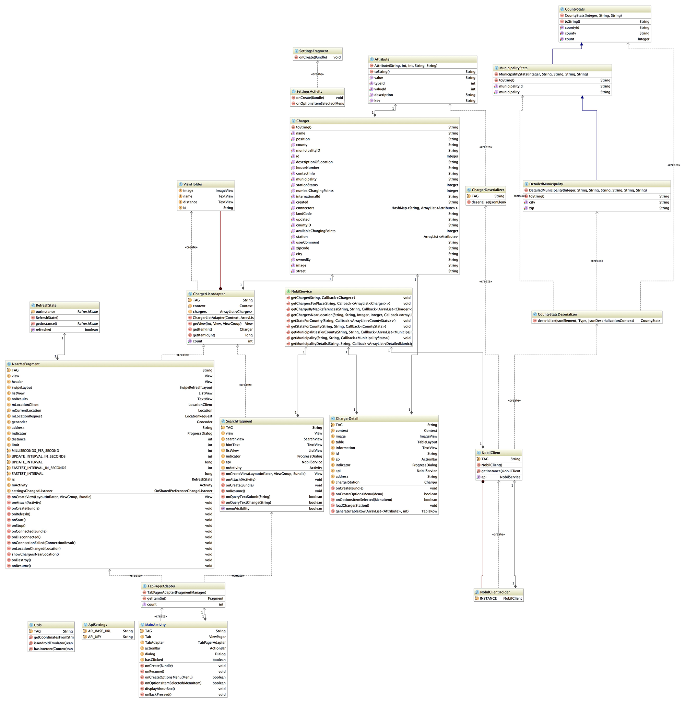
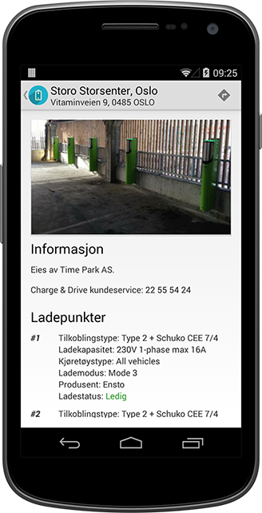
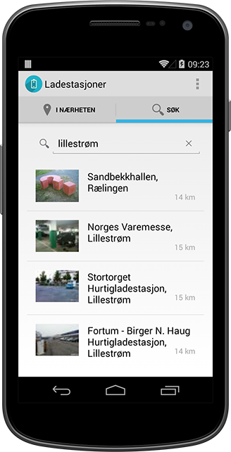
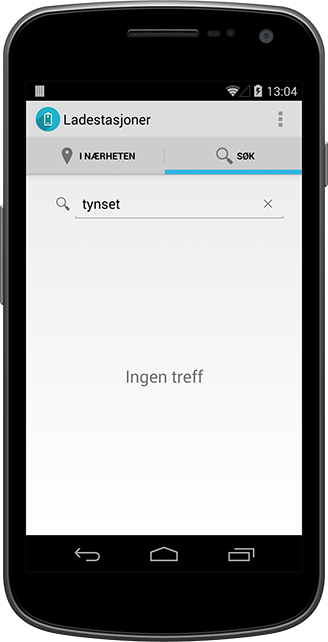
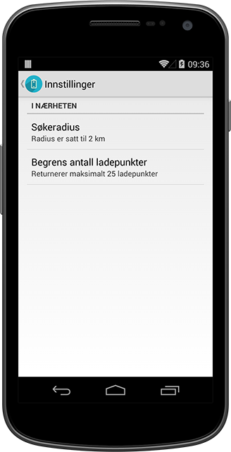

#  Ladestasjoner


Utført og levert av Even Holthe <[s189124@stud.hioa.no](mailto:s189124@stud.hioa.no)>

## 1.0 Introduksjon

Dette dokumentet dokumenter mappeinnlevering #3 i faget Applikasjonsutvikling (DAVE3600). I dette dokumentet finner du generelle begrunnelser på design- og implementasjonsdetaljer, samt en oversikt over de forskjellige komponentene i applikasjonen.



## 2.0 Ladestasjoner

Idéen kom tidlig med å lage en app som kunne vise ladestasjoner for elbiler. Til dette har [Nobil](http://nobil.no) et API som tilbyr data under en liberal lisens. Jeg bestemte meg da for at applikasjonen skal tilby to hovedfunksjoner:

1. Kunne vise ladestasjoner i brukerens nærhet 
2. Kunne søke opp geografiske steder og vise ladestasjoner 

Til dette skulle brukes lister, da dette er en hensiktsfull måte å presentere data på. For hver oppføring i listen kan man få se en detaljert visning.

### 2.1 Detaljert visning



Den detaljerte visningen viser et større bilde av ladestasjonen (delvis skjult i skjermskuddet), hvem som eier den, kontaktinformasjon og de ulike ladepunktene tilknyttet ladestasjonen. For hvert ladepunkt vises det informasjon om tilkoblingstype, ladekapasitet, kjøretøystype, lademodus, produsent og ladestatus (om tilgjengelig fra Nobil). Da kan man lett se om ladepunktet er kompatibelt med eget kjøretøy, og eventuelt om punktet er ledig.

Fra den detaljerte visningen kan man også enkelt få en veibeskrivelse, via et ikon i appens `ActionBar`. Denne knappen åpner Google Maps med adressen til ladestasjonen vha. et `Intent`.

### 2.2 I nærheten


Visningen "I nærheten" (fragment `NearMeFragment`) henter brukerens geografiske posisjon, sender denne til API'et og får tilbake JSON-data, som omtolkes til en liste med ladestasjoner i nærheten. Alle søk foretas innen en radius på 3km, med visning av maks 25 ladestasjoner som standard. Dette kan endres i innstillingene, som er tilgjengelig i appens `ActionBar`, gitt at brukeren ikke står i en detaljert visning av en ladestasjon.

Her er det implementert en indikator (`ProgressDialog`) som viser til brukeren at ny data lastes inn, eller at nye innstillinger tas i bruk. For å manuelt oppdatere dataene er `SwipeRefreshLayout` tatt i bruk for å implementere en "Pull to refresh""-funksjonalitet.

### 2.3 Søk

 

Her kan brukeren søke etter en by/sted etter eget ønske. Ved visning av `SearchFragment` vil brukeren få et inputfelt, samt en hjelpetekst. Denne ber brukeren søke etter et sted under normale omstedigheter, eller indikerer fravær av internett-forbindelse hvis det er tilfellet.

Finnes det resultater, vises dette i en liste tilsvarende `NearMeFragment`. Hvis det ikke er 0 resultater, vises en meldingen "Ingen treff".

Søket er langt fra perfekt, og begrenser seg stort sett til byer og i noen tilfeller gateadresser. Dette skyldes hvordan backend'en er kodet, og den begrensende tiden som var til rådighet. Dette vil bli videreutviklet i en fremtidig versjon av applikasjonen.

### 2.4 Innstillinger



Det er implementert støtte for brukerdefinerte innstillinger, gjennom å bruke [`Preference`](http://developer.android.com/guide/topics/ui/settings.html)-API'et som igjen bruker `SharedPreferences` for å lagre de ulike innstillingene. Her kan brukeren velge en søkeradius for ladestasjoner i nærheten, samt hvor mange ladestasjoner han/hun maksimalt vil se (kun for "I nærheten").

## 3.0 Teknologi

### 3.1 API Proxy
Måten man kaller på API'et virket på meg veldig tungvindt, sett fra en Android- og Java-kontekst. Man kaller på samme endepunkt (vha. POST), men med ulike parametere. For hvert kall får man også tilbake lisensieringsdata, som egentlig er unødvendig sett fra en applikasjons ståsted.

Jeg valgte derfor å skrive [min egen proxy](https://github.com/evenh/nobil-api-proxy), eller mellomvare om du vil. Dette gjorde programmeringen lettere, i tillegg lot den meg lett implementere (en *proof of concept*-utgave av) stedssøk på serversiden.

### 3.2 Biblioteker
> Det går helt fint å bruke biblioteker, man trenger da ikke finne opp hjulet på nytt
>
> *– Torunn Gjester, faglærer*

I applikasjonen benytter jeg meg av noen biblioteker. Dette gjøres for å spare kodeskriving, og for å spare systemets ressurser. På en mobil enhet er ytelse viktig, da det er svært begrensende ressurser tilgjengelig til hver applikasjon.

- **[Retrofit](http://square.github.io/retrofit/)**
Benyttes for nettverkskall, da dette biblioteket tilyr funksjonalitet for å kalle REST-API'er på en lettfattelig og sikker måte.
- **[Gson](https://code.google.com/p/google-gson/)**
For å konvertere JSON-data til Java-objekter bruker jeg Google's Gson-bibliotek. Dette besparer tid når det kommer til programmering og ytelsestuning.
- **[Picasso](http://square.github.io/picasso/)**
Brukes for å dynamisk laste inn bilder ettersom de trengs å vises i et `ListView`. Picasso cacher bildedata, så de kan kjappere lastes inn senere.
- **[Android Support Library](http://developer.android.com/tools/support-library/index.html)**
Brukes for `SwipeRefreshLayout` ("Pull to refresh"-funksjonalitet), `FragmentActivity` og `ViewPager` (for å kunne bla gjennom faner).

### 3.3 Utfordringer
**Lokasjon gjennom Google Play Services**
I emulatoren hadde jeg problemer med å få en geografisk posisjon når jeg brukte Google Play Services. Man kan komme rundt dette ved å sende en `geo fix`-kommando vi adb eller gjennom telnet, men det krever at man gjør det for hver instans av applikasjonen som skal kjøres i emulatoren. Dette viste seg å være tungvindt i testing, så jeg konsulterte med faglærer og vi ble enige om å prøve en alterativ måte.

Slik det fungerer nå, detekteres det om det er emulatoren som kjører. Hvis det er tilfellet, opprettes en fixed posisjon ved hjelp av følgende kodesnutt (implementert i `NearMeFragment`):

```java
// Provide a fixed location for the emulator
if (Utils.isAndroidEmulator()) {
	Log.i(TAG, "Detected emulator, simulating location...");

	Location mockLocation = new Location("Pilestredet 35 Mock Location Provider");
	mockLocation.setLatitude(59.919570);
	mockLocation.setLongitude(10.735562);

	mCurrentLocation = mockLocation;
	mLocationClient.setMockLocation(mockLocation);
	onLocationChanged(mockLocation);
}
```

## 4.0 Kilder

+ Ikon hentet fra [IconArchive](http://www.iconarchive.com/show/battery-icons-by-graphicloads/battery-polarity-icon.html)
+ Ladestasjondata fra [Nobil](http://nobil.no) under Creative Commons 3.0 Unported-lisensen.